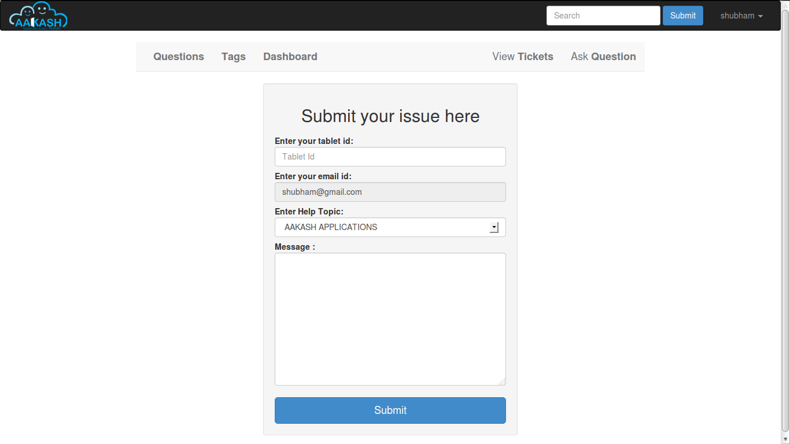
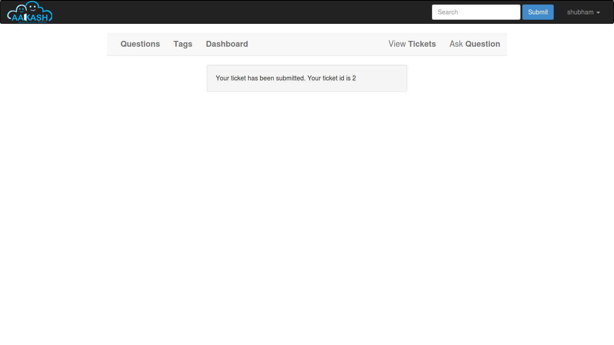
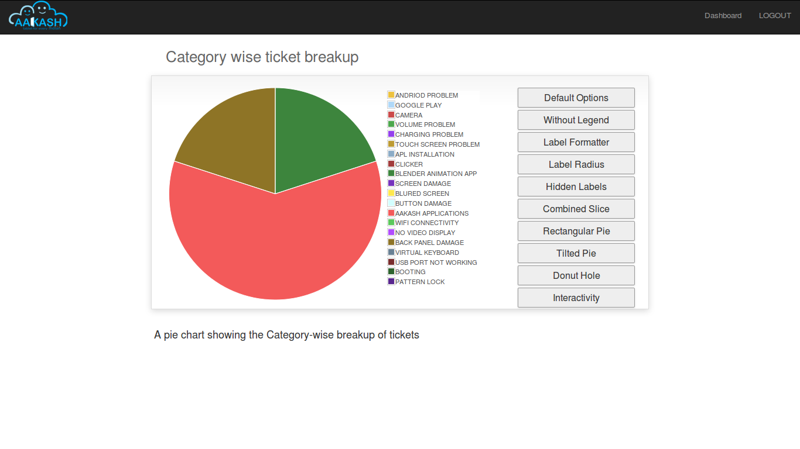
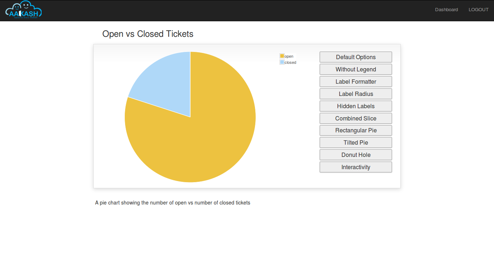
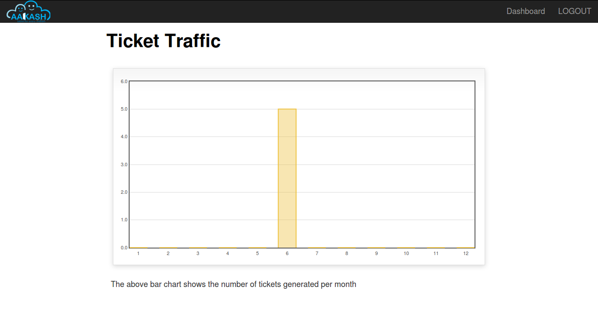

User's guide
============

Introduction
------------

The Aakash Tech Support Portal is a online Portal, which is divided into two modules, Aakash Tech Support and Discussion forums.

Tech support Provided a Aakash tablet users a platform to discuss the technical Problem that they face with the tablet. Discussion Forum, FAQ and submit ticket features are provided to the users to help him solve the problem.

Aakash Portal is Open Source software. Therefore it is going to be freely available. It is Platform Independent, easy to operate and maintain.

* Why Python-Django

  Talk about Python programming language and Python web framework:
  Django. Talk about advantage of using python over other programming languages.

* GIT

  Tell why you used GIT to manage this project. Also talk about other
  version control software.

* GNU/Linux

  Talk about GNU, Linux, and Open source. Also mention other linux
  distros and describe Ubuntu.

Description
-----------

Here you will describe your project's workflow like how the different
sections(Books, Contributor, Reviewer) are divided and why. Basically
you will talk about models buy in layman term. This should be
understood by any non-technical user. This section should consume
about 70% of the user-guide.

Workflow
~~~~~~~~

Describe models(in layman terms)

Interface
~~~~~~~~~

Explain each page in detail with screen-shots.

Example:

.. figure:: _static/images/aakash.png
   :height: 600 px
   :width: 900 px
   :scale: 50 %
   :alt: Login page
   :align: center

   Login page

Ticketing System
~~~~~~~~~~~~~~~~

The ticket submission system allows the user to submit his issues for resolution by the tech support officials in case the FAQs and discussion forum do not provide enough information.

The user is able to go to the submit ticket page by clicking on the link to the same on the home page; provided he is logged in.A user is allowed to submit a ticket only if he is logged in. If a user tries to submit a ticket without being logged in; he is redirected to the login page.Once the user has been logged in and is on the submit ticket page; in order for him to submit his issue he has to provide the following details:

* Tablet id: The tablet id is an eight digit number inscribed on the back of every aakash tablet.
* Message: The details of the problem that the user is facing goes here.
* Category of the problem: The user is given a drop down list of categories to select from.
* Email : The email field is automatically populated with the email id of the logged in user.

   Submit ticket page

Once the user has submitted his details, the tablet id is validated to see that its genuine; following which the user is taken to a page where his unique ticket id is displayed. The user can quote this ticket id later to refer to the problem in future.

A screenshot of the page showing the ticket number so generated is shown below:

   Page displaying ticket id after the ticket is submitted

The view tickets feature for the user to view the details of all the tickets submitted by him
~~~~~~~~~~~~~~~~~~~~~~~~~~~~~~~~~~~~~~~~~~~~~~~~~~~~~~~~~~~~~~~~~~~~~~~~~~~~~~~~~~~~~~~~~~~~~

The user can view the details of all the tickets submitted by him; provided he is logged in.

The details displayed include the ticket id, the status of the ticket (whether open or closed), the created date and time of the ticket, the priority of the ticket, the tablet id of the user, the message submitted by the user and the reply posted by the admin
The link for the user to view his submitted tickets’ details is present on the page displayed to the user once he logs in. If the user is not logged in; he is not shown the link to view the submitted tickets.

The user can close the ticket once he is satisfied with the reply by clicking on the close ticket option.

The following screenshot shows the page containing the ticket details of the user; when he clicks on the view tickets link:

.. figure:: _static/images/view_tickets.png
   :height: 600 px
   :width: 900 px
   :scale: 50 %
   :alt: page containing the ticket details of the user
   :align: center

   Page containing the ticket details of the user

The chart/graph display system on the admin dashboard
~~~~~~~~~~~~~~~~~~~~~~~~~~~~~~~~~~~~~~~~~~~~~~~~~~~~~

The admin can conveniently visualize the statistics about the tickets generated and resolved by using interactive charts and graphs.
Three different graphs/charts have been implemented:

* A pie chart showing the Category-wise breakup of tickets.

   pie chart showing the Category-wise breakup of tickets

* A pie chart showing the number of open vs number of closed tickets.

   
    pie chart showing the number of open vs number of closed tickets

* A bar chart showing the number of tickets generated per month.

   
    pie chart showing the number of tickets generated per month

The pie charts are interactive and can be rendered in different ways as desired by the admin; by clicking on the buttons along the right margin.

The admin dashboard
~~~~~~~~~~~~~~~~~~~
The admin dashboard  system allows the admin to check the submitted issues by aakash  tablet id holders in case the FAQs and discussion forum do not provide enough information.To access the admin panel the admin should be logged in with his corresponding id and  password.The main page of the admin dashboard shows all the tickets submitted by the  user and the category of the  problem.

A screenshot of the page showing the ticket number so generated is shown below:

Dashboard Features
~~~~~~~~~~~~~~~~~~

* Graphical Representation of Data : Graphical representation of ticketing data can be access from the admin dashboard pannel

* Search: Admin can search for a specific ticket  submitted by the user by its Ticked ID or by User Email. Admin can also search for ticket in specific categories i.e. by typing ANDROID all the ticket corresponding to the android categories will be displayed in the dashboard

The  Reply interface between user and admin
~~~~~~~~~~~~~~~~~~~~~~~~~~~~~~~~~~~~~~~~~~~

Reply interface allows admin to reply the query of a specific ticket by clicking on it's 
Ticket id screenshot of the page showing the  of a particular ticket number is shown below:

The above Page show the all Details of a particular ticket along with the problem message submitted by the user. The admin  can reply correspondingly to the problem in the response section and by clicking Post Reply to send a e-mail to the user. The top of the page also shows the statistics of open and close tickets

Conclusion
----------

Give good reasons on how your app/project is going to benefit Aakash
project, students, teachers and general public

Reference
---------

List of reference like books, links you used.

